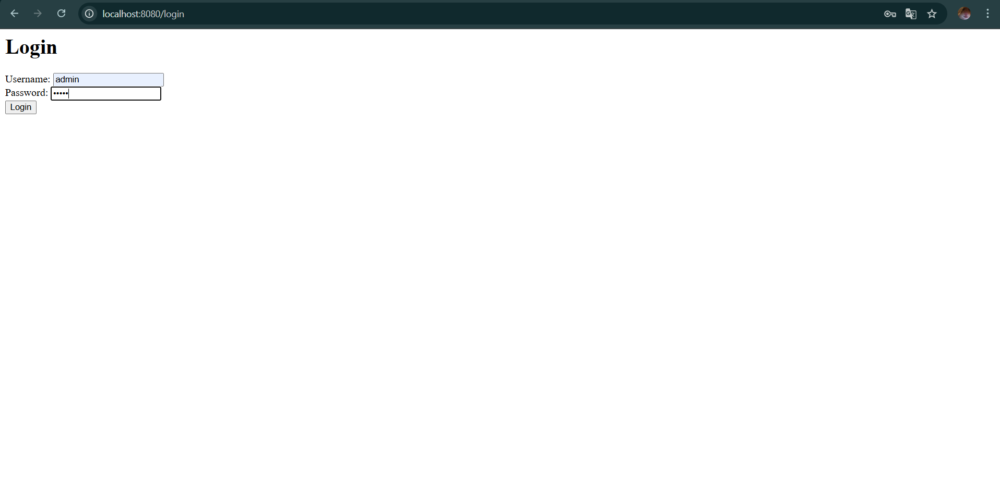
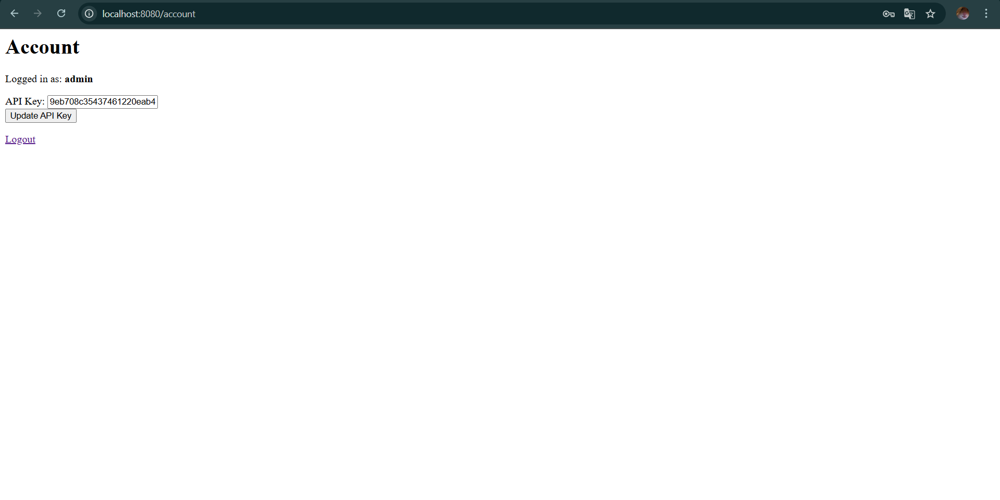
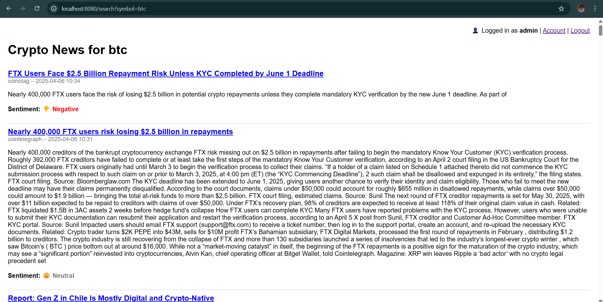
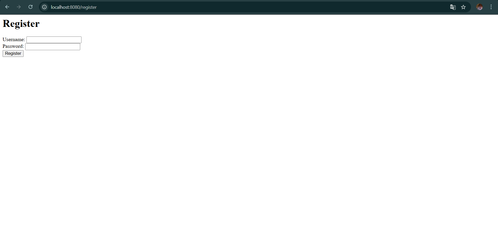

# 📰 Crypto News Aggregator

Rust-based fullstack app that aggregates and analyzes the latest cryptocurrency news. Auth, sentiment scoring, API key management — all in one.

---

## ✨ Features

- 🔐 User authentication with MongoDB backend
- 🔑 API key generation and update
- 🔍 Search for news by cryptocurrency symbol (BTC, ETH, etc.)
- 📊 Sentiment analysis of articles (Positive, Neutral, Negative)
- 📡 Real-time data from CoinGecko & CryptoCompare
- 🛡️ Protected routes using JWT sessions
- 🧼 Clean error handling and redirect flows

---

## 📸 Demo Screenshots

| Login | Account |
|-------|---------|
|  |  |

| News Results | Register Page |
|--------------|------------|
|  |  |

---

## ▶️ Usage

### 1. Start Rust Web App

```bash
cargo run
